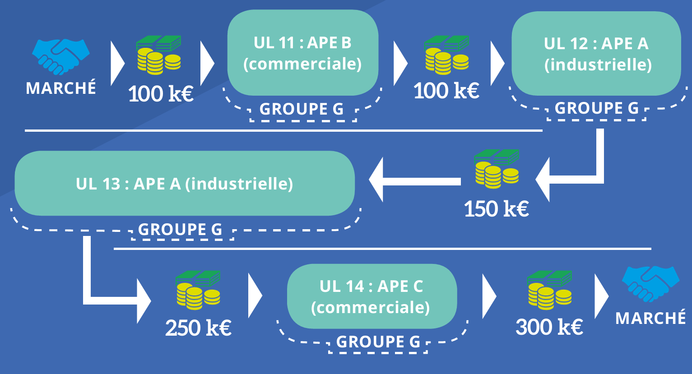

# Le Contexte : le travail de profilage à l'INSEE

## La division Profilage (PTGU)

- Le stage s'est déroulé au sein de la division « **P**rofilage et **T**raitement des **G**randes **U**nités ».
- Mission : [**Consolider et analyser**]{.orange} les structures des grands groupes d’entreprises.
- Le **profilage** vise à définir une [**entreprise**]{.blue2} au sens économique, et non plus seulement juridique (Unité Légale - UL).

## Pourquoi le profilage est essentiel ?

Avant le profilage, l'agrégation simple des Unités Légales (UL) masquait la réalité économique :

- Les [**flux intra-groupe**]{.orange} pouvaient gonfler artificiellement le chiffre d’affaires agrégé.
- L'approche purement juridique créait des [**ruptures de séries**]{.orange} lors des restructurations.

{width="25%" class="lightbox"}

L'objectif est de garantir la [**cohérence et la continuité**]{.blue2} des agrégats économiques.

## Le profilage manuel (Cible 1)

Pour les plus grands groupes (~60), le travail des profileurs est un processus en 5 étapes clés :

1.  Sélection des UL et envoi de l’enquête ESA.
2.  [**Collecte des périmètres**]{.blue2} via visites et échanges.
3.  [**Construction des comptes consolidés**]{.blue2} (retraitements, ajustements bilanciels).
4.  [**Contrôles de cohérence**]{.blue2} avec de multiples sources (liasses fiscales, rapports annuels...).
5.  Intégration dans la base Esane.

# La Problématique : l'extraction du tableau "Filiales et Participations"

## Une source d'information cruciale

- Au cœur des contrôles de cohérence se trouve le tableau "**Filiales et Participations**".
- Il est essentiel pour [**vérifier les contours des groupes**]{.orange}.
- Aujourd'hui, son exploitation est [**entièrement manuelle**]{.orange} : le profileur lit le PDF et recopie les informations.

## Le défi technique

L'automatisation de l'extraction est difficile car les documents sont très hétérogènes.

:::: {.columns}

::: {.column width="50%"}
{class="lightbox"}
:::

::: {.column width="50%"}
{class="lightbox"}
:::

::::

Le but est de passer [**automatiquement**]{.blue2} du document brut à une table de données propre.

# Les Données : un corpus hétérogène

## Source et Caractéristiques

- **Source** : Les documents sont récupérés via [**l'API de l'INPI**]{.blue2}.
- **Périmètre** : La "Cible 1", soit environ 60 groupes majeurs.
- **Formats** : Un mélange de [**PDF numériques**]{.orange} (avec couche texte) et de [**PDF scannés**]{.orange} (simples images), souvent de qualité variable.

## Exemples de documents

:::: {.columns}

::: {.column width="45%"}
**Structure originale**
{class="lightbox"}
:::

::: {.column width="5%"}
:::

::: {.column width="45%"}
**Mauvaise qualité de scan**
{class="lightbox"}
:::

::::

Cette hétérogénéité rend les [**approches algorithmiques classiques peu robustes**]{.blue2}.

# L'approche précédente : une méthode séquentielle

## Le pipeline

La méthode précédente reposait sur un pipeline en plusieurs étapes :

1.  [**Identification de la page**]{.blue2} avec un modèle de classification de texte (`fastText`).
2.  [**Extraction de la structure du tableau**]{.blue2}. Pour cette étape, plusieurs modèles concurrents ont été évalués, dont :
    - `TableNet` : un modèle de segmentation d'image.
    - `Table Transformer` : un modèle pré-entraîné sur la reconstruction de structure.

C'est l'approche [**Table Transformer**]{.orange} qui a été retenue, formant la méthode finale.

# Rupture Technologique : Les LLMs

## Comment un LLM "comprend" le texte ?

La première étape est de transformer les mots en nombres que le modèle peut manipuler.

1.  [**Tokenisation**]{.orange}  
    Le texte est découpé en unités de base, les *tokens* (mots ou sous-mots).
    `"Extraire ce tableau"` ➡️ `["Extraire", "ce", "tableau"]`

2.  [**Vectorisation (Embedding)**]{.orange}  
    Chaque token est associé à un vecteur numérique de grande dimension. Ce vecteur représente la **position sémantique** du token dans un espace de concepts.
    `"Extraire"` ➡️ `[0.12, -0.45, ..., 0.88]`

Les mots aux significations proches auront des vecteurs proches dans cet espace.

## Le cœur du LLM : l'Architecture Transformer

Le **Transformer** traite cette séquence de vecteurs.

- Son innovation : le mécanisme de **self-attention** (auto-attention).

- Pour chaque token, le modèle [**pèse l'importance de tous les autres tokens**]{.orange} de la séquence pour comprendre son contexte.

Ce processus reste [**purement textuel et "aveugle"**]{.blue2} à la mise en page.

## Du LLM au LLM Multimodal

Comment apprendre à un modèle de langage à "voir" ?

La réponse méthodologique : [**traiter l'image comme une séquence de tokens**]{.blue2}, de la même manière que le texte.

- On ne donne pas au modèle une grille de pixels, mais une séquence de **"tokens visuels"**.
- Chaque token visuel représente une petite zone de l'image.
- Le modèle peut alors appliquer son mécanisme d'attention sur une **séquence mixte** de tokens de texte et de tokens visuels.

## La "Tokenisation Visuelle" en pratique

Le processus se fait en 3 étapes clés :

1.  [**Découpage en Patchs**]{.orange}  
    L'image est découpée en une grille de petites imagettes (*patches*).

2.  [**Vectorisation**]{.orange}  
    Chaque patch est transformé en un vecteur numérique, le **token visuel**.

3.  [**Séquençage**]{.orange}  
    Le LLM traite alors cette nouvelle **séquence de tokens visuels** comme il le ferait pour une phrase.

# Mon Approche : Une Architecture Robuste et Hybride

## Architecture en Microservices

Pour garantir la robustesse et la scalabilité, la solution est bâtie sur une architecture en 3 microservices.

<!-- NOTE: Intégrez ici votre schéma d'architecture montrant API Centrale, API Marker, Proxy et les flux. -->

- [**API Centrale**]{.orange} : L'**orchestrateur** qui pilote le flux.
- [**API Marker**]{.orange} : Le **moteur d'analyse** qui traite le document.
- [**Proxy Marker**]{.orange} : Le **superviseur** qui monitore les appels au LLM.

---
.png)

## Focus sur `marker-pdf` : une Approche Hybride

L'approche de la librairie `marker-pdf` est en plusieurs temps :

1.  [**Segmentation rapide par vision (`Surya`)**]{.blue2}  
    Un modèle spécialisé délimite les blocs de contenu (tableaux, textes...).

2.  [**Extraction initiale**]{.blue2}  
    Une première version du tableau est générée (OCR si besoin).

3.  [**Correction par LLM (`Gemma-3 27b it`)**]{.blue2}  
    Le LLM affine cette première version en la comparant à l'image.

Résultat : une combinaison de la [**vitesse**]{.orange} des modèles spécialisés et de la [**précision**]{.orange} du LLM.

## Le Pipeline de Traitement Global

Le processus complet, orchestré par l'API Centrale, est donc le suivant :

1.  [**Acquisition & Ciblage**]{.blue2} : Récupération du PDF (API INPI) et identification de la page (`fastText`).
2.  [**Isolation**]{.blue2} : Création d'un PDF temporaire avec la seule page d'intérêt pour **focaliser l'analyse**.
3.  [**Analyse Hybride par `marker-pdf`**]{.blue2} : Application du pipeline (Surya + Gemma-3) sur la page isolée.
4.  [**Restitution**]{.blue2} : Export au format **JSON**, qui préserve les structures complexes comme les cellules fusionnées.

# Méthode d'Évaluation des Modèles

## Le protocole

- Pour garantir une comparaison juste, le [**même jeu d'évaluation que l'ancienne méthode**]{.orange} a été utilisé (74 tableaux annotés manuellement).
- Les [**mêmes métriques**]{.orange} ont été calculées :
    - Taux de colonnes récupérées
    - Taux de lignes récupérées
    - Taux de cellules numériques correctement extraites [**\***]{.orange}
    - Taux d'extraction parfaite (tableau 100% correct) [**\***]{.orange}

# Résultats

## Résultats Quantitatifs {.smaller}

| Métrique | M1 (Table Transformer) | **Approche LLM (Hybride)** |
|:---|:---:|:---:|
| Taux moyen de colonnes extraites| .80 | **.71** |
| Taux moyen de lignes extraites| .76 | **.70** |
| Taux moyen de cellules num. extraites | .56 | **.60\*** |
| Taux d'extraction parfaite | .21 | **.78\*** |

<!-- NOTE: Remplacez les placeholders par vos résultats réels. -->

Des résultats en dessous de la méthode précédente expliqué par plusieurs facteurs

## Analyse Qualitative

:::: {.columns}

::: {.column width="45%"}
{class="lightbox"}
:::

::: {.column width="45%"}
{class="lightbox"}
:::

::::

Médiane : colonnes 86% -	lignes 92%

3e Quartile : colonnes 100% - lignes	100%

## Concentration des erreurs sur quelques documents
:::: {.columns}

::: {.column width="45%"}
{class="lightbox"}
:::

::: {.column width="45%"}
{class="lightbox"}
:::

::::

La majorité des erreurs se concentre sur un petit nombre de documents particulièrement complexes, expliquant la baisse des moyennes globales.

# Perspectives

## Pistes d'Amélioration

- [**Pistes pour le Modèle**]{.orange}
    - [**Fine-tuning**]{.blue2} : Envisageable à long terme si un corpus d'annotation conséquent est constitué, mais coûteux.
    - [**Veille active**]{.blue2} : Tester les nouvelles générations de modèles et de logiciels

- [**Pistes pour l'Application**]{.orange}
    - Possibilité de tester plus de précision dans l'utilisation de marker
    - optimisation de performance au niveau de l'OCR et du LLM lab

# Merci

